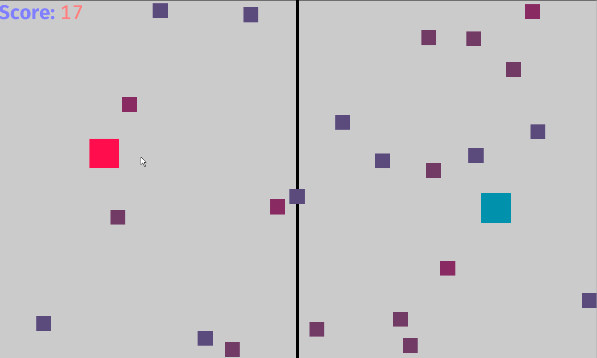

# Bevy Game jam Game 2022

This is a a game I am making for the [#1 Bevy game jam 2022](https://itch.io/jam/bevy-jam-1). It's mainly to test the bevy engine as it uses rust plus the awesome ECS system that I've always wanted to try and use for a game!

[Now playable on Itch.io!](https://skcode.itch.io/dodging-creatures)



# Install

```bash
rustup target install wasm32-unknown-unknown
cargo install wasm-server-runner
cargo install wasm-bindgen-cli
```

# Run locally

```bash
cargo run
```

# Building for Release

## Web (WASM)

```bash
cargo build --release --target wasm32-unknown-unknown
wasm-bindgen --out-dir ./out/ --target web ./target/wasm32-unknown-unknown/release/double-dodge.wasm
```

This will:

- Generate release artifacts
- put all the WASM bindings needed to run on the web in the `/out` directory

After that zip up:

- `index.html`
- `/out` directory
- `/assets` directory

and submit it to Itch.io to play!

## Windows

- TODO

## Mac OS

- TODO

## Linux

- TODO
